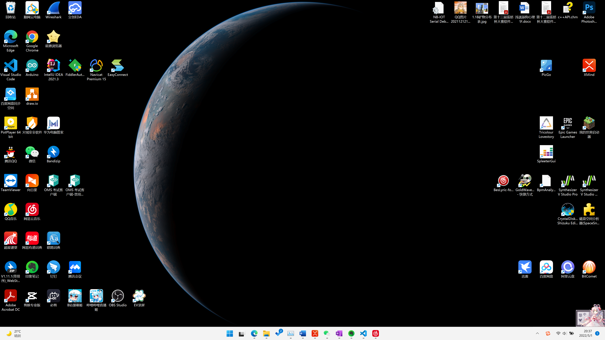

# 目的
从[这](https://sc-nc-web.nict.go.jp/wsdb_osndisk/shareDirDownload/bDw2maKV?lang=en)爬取地球实时图片设置为分辨率4k的壁纸，例子如下

# 使用
命令行运行``python earth.py``，自动设置桌面壁纸为地球最新影像，默认为日本向日葵8号卫星每10分钟拍着的全彩全盘无灰影像

# 说明
1. 下载到的原图放在``.\img``目录下
2. 构建的壁纸``background.png``放在``earth.py``同级目录
3. 下载原图分辨率12k*12k，正午大小约为150MB，半夜10几MB，为减少对服务器宽带占用，让真正需要用图片科研的人员留足下载空间，请避免高频下载QAQ，一小时或者半小时一次得了。

# 参考
python requests库下载图片保存到本地
https://blog.csdn.net/qq_32502511/article/details/82752447

# TODO
- [] 如果有能建成镜像站就好了，只上传壁纸QAQ
- [] 剩余图源，如咋们国家的风云4a卫星，待开发
- [] 壁纸添加文字（会不会略微多余？

# 制作过程
2022年4月25日15:21:19
## 抽象出两大部分：
1. 获取地球实时图像
2. 生成壁纸并设置

2022年5月1日20:45:53
## 优化
1. 添加日志显示信息
2. 编写readme使用说明